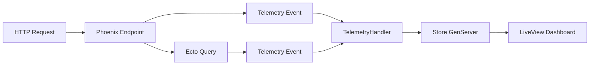

<div align="center">
  
</div>

# ElixirDashboard

[](https://hex.pm/packages/elixir_dashboard)
[](https://hexdocs.pm/elixir_dashboard)
[](LICENSE)

**A Phoenix LiveView performance monitoring dashboard for tracking slow endpoints and database queries during development.**

ElixirDashboard is a lightweight, zero-configuration monitoring tool that helps you identify performance bottlenecks in your Phoenix application by tracking slow HTTP endpoints and database queries in real-time.

## Features

- 🚀 **Zero Configuration** - Works out of the box with sensible defaults
- 📊 **Real-time Monitoring** - LiveView dashboards with auto-refresh
- 🎯 **Dual Purpose** - Use as a library in your app OR run standalone
- 🔍 **Request Correlation** - See which endpoints triggered slow queries
- 🎨 **Color-coded Metrics** - Visual performance indicators
- ⚡ **Lightweight** - Minimal dependencies, in-memory storage
- 🛡️ **Development-Only** - Automatically disabled in production
- 🔧 **Fully Configurable** - Customize thresholds, limits, and intervals

## Quick Start

### As a Library (Recommended)

Add to your Phoenix application in 3 simple steps:

#### 1. Add Dependency

```elixir
# mix.exs
def deps do
  [
    {:elixir_dashboard, "~> 0.2.0"}
  ]
end
```

```bash
mix deps.get
```

#### 2. Add to Supervision Tree

```elixir
# lib/my_app/application.ex
defmodule MyApp.Application do
  use Application

  def start(_type, _args) do
    children = [
      MyApp.Repo,
      {Phoenix.PubSub, name: MyApp.PubSub},
      # Add ElixirDashboard
      ElixirDashboard.PerformanceMonitor.Supervisor,
      MyAppWeb.Endpoint
    ]

    # Attach telemetry handlers (development only)
    if Mix.env() == :dev do
      ElixirDashboard.PerformanceMonitor.TelemetryHandler.attach()
    end

    opts = [strategy: :one_for_one, name: MyApp.Supervisor]
    Supervisor.start_link(children, opts)
  end
end
```

#### 3. Add Routes

```elixir
# lib/my_app_web/router.ex
if Mix.env() == :dev do
  scope "/dev" do
    pipe_through :browser

    live "/performance/endpoints", ElixirDashboard.PerformanceLive.Endpoints, :index
    live "/performance/queries", ElixirDashboard.PerformanceLive.Queries, :index
  end
end
```

#### 4. Configure (Optional)

```elixir
# config/dev.exs
config :elixir_dashboard,
  # Application name shown in UI (default: "ElixirDashboard")
  app_name: "MyApp Dashboard",
  # Maximum items to keep in memory (default: 100)
  max_items: 100,
  # Endpoint threshold in milliseconds (default: 100)
  endpoint_threshold_ms: 100,
  # Query threshold in milliseconds (default: 50)
  query_threshold_ms: 50,
  # Auto-refresh interval in milliseconds (default: 5000)
  refresh_interval_ms: 5000,
  # Ecto repo telemetry prefixes to monitor
  repo_prefixes: [[:my_app, :repo]]
```

**Important:** Set `repo_prefixes` to match your Ecto repo module name.

The `app_name` will appear in:
- Page titles (browser tab)
- Navigation bar
- Dashboard headers

That's it! Visit `http://localhost:4000/dev/performance/endpoints` 🎉

### As a Standalone App (Demo/Development)

```bash
git clone https://github.com/nshkrdotcom/elixir_dashboard.git
cd elixir_dashboard
mix deps.get
./start.sh
```

Visit `http://localhost:4000`

---

## 🧪 Testing the Dashboard (Demo Mode)

The standalone app includes a complete demo system with **real slow queries** and **persistent DETS storage**.

### Quick Test - Generate Data Instantly

With the server running (`./start.sh`), open a new terminal and run:

```bash
# Generate 20 random slow requests (HTTP calls to demo endpoints)
mix dashboard.test 20

# Output:
# 🚀 Generating 20 test requests to http://localhost:4000...
# ....................
# ✓ Generated 20 test requests
#
# Refresh browser to see results:
#   http://localhost:4000/dev/performance/endpoints
#   http://localhost:4000/dev/performance/queries
```

**Then refresh your browser** - you'll immediately see slow endpoints and queries!

### CLI Commands

#### `mix dashboard.test [count]`
Generates test traffic by making HTTP requests to demo endpoints.

**Server must be running!**

```bash
mix dashboard.test 50   # Generate 50 random slow requests
```

Randomly hits these endpoints:
- `/demo/slow_cpu?ms=150` - CPU delay (Process.sleep)
- `/demo/slow_query?seconds=0.1` - Database delay (pg_sleep)
- `/demo/complex_query` - Complex JOIN with aggregation
- `/demo/multiple_queries` - Multiple correlated queries
- `/demo/random_slow` - Random delays

#### `mix dashboard.stats`
View current statistics from DETS storage.

```bash
mix dashboard.stats

# Output:
# === ElixirDashboard Statistics ===
#
# Storage Type:    DETS
# Storage Path:    priv/dets
# Max Items:       100
#
# Endpoints:       47 recorded
# Queries:         89 recorded
#
# Top 5 Slowest Endpoints:
#   521ms - GET /demo/random_slow
#   203ms - GET /demo/slow_cpu?ms=150
#   ...
```

#### `mix dashboard.slow_query [seconds]`
Execute a single slow query directly (without HTTP).

```bash
mix dashboard.slow_query 0.2

# Output:
# 🐘 Executing slow query (pg_sleep 0.2s)...
# ✓ Query completed
#   Found 1000 users in database
```

#### `mix dashboard.clear`
Clear all recorded data from DETS.

```bash
mix dashboard.clear

# Output:
# ✓ Dashboard data cleared
```

### Demo Endpoints (Click to Test)

With the server running, visit these URLs in your browser:

| URL | Description | Expected Duration |
|-----|-------------|-------------------|
| http://localhost:4000/demo/slow_cpu?ms=200 | CPU-bound delay | ~200ms |
| http://localhost:4000/demo/slow_query?seconds=0.15 | Database pg_sleep | ~150ms |
| http://localhost:4000/demo/complex_query | Complex JOIN + aggregation | ~80-100ms |
| http://localhost:4000/demo/multiple_queries | Multiple correlated queries | ~200ms |
| http://localhost:4000/demo/random_slow | Random delays | 100-500ms |

### Persistent Storage (DETS)

Unlike in-memory storage, DETS persists data across server restarts:

```bash
# Generate some data
mix dashboard.test 10

# Restart the server
# Your data is still there! Check the dashboards.
```

**Storage location:** `priv/dets/`
- `endpoints.dets` - Slow endpoint data
- `queries.dets` - Slow query data

### Why You See Nothing Initially

The dashboards start **empty by design** because:

1. **No slow requests yet** - You need to trigger endpoints that exceed the thresholds
2. **Thresholds matter** - Only endpoints >100ms and queries >50ms are captured
3. **Real monitoring** - This mirrors production behavior (you only see actual slow requests)

**To populate the dashboard:**
1. Run `mix dashboard.test 20` (easiest!)
2. OR click the demo endpoint links on the homepage
3. OR manually visit the `/demo/*` URLs
4. Refresh the dashboard pages to see results

---

## What You Get

### Slow Endpoints Dashboard (`/dev/performance/endpoints`)

Track your slowest HTTP endpoints with real-time updates:

- Duration in milliseconds
- HTTP method and path
- Timestamp
- Color-coded severity (green → yellow → orange → red)
- Auto-refresh every 5 seconds
- One-click data clearing

### Slow Queries Dashboard (`/dev/performance/queries`)

Monitor database performance:

- Query duration
- Full SQL text
- Query parameters
- Originating endpoint (request correlation)
- Timestamp
- Color-coded severity

## How It Works

ElixirDashboard uses Phoenix's built-in `:telemetry` events:



1. **Phoenix emits** `[:phoenix, :endpoint, :stop]` events for HTTP requests
2. **Ecto emits** `[app, :repo, :query]` events for database queries
3. **TelemetryHandler** captures events above configured thresholds
4. **Store GenServer** maintains top N slowest items in memory
5. **LiveView** displays data with auto-refresh

## Configuration

All settings are optional with sensible defaults:

| Option | Default | Description |
|--------|---------|-------------|
| `app_name` | `"ElixirDashboard"` | Application name displayed in UI (nav, titles, headers) |
| `max_items` | `100` | Maximum items to keep in memory per category |
| `endpoint_threshold_ms` | `100` | Only capture endpoints slower than this (ms) |
| `query_threshold_ms` | `50` | Only capture queries slower than this (ms) |
| `refresh_interval_ms` | `5000` | LiveView auto-refresh interval (ms) |
| `repo_prefixes` | `[]` | List of Ecto repo telemetry prefixes |

### Finding Your Repo Prefix

Your Ecto repo module determines the telemetry prefix:

```elixir
# If your repo is:
defmodule MyApp.Repo do
  use Ecto.Repo, otp_app: :my_app
end

# Then your prefix is:
repo_prefixes: [[:my_app, :repo]]

# For multiple repos:
repo_prefixes: [[:my_app, :repo], [:my_app, :read_repo]]
```

## API Reference

### Programmatic Access

```elixir
# Get slow endpoints
endpoints = ElixirDashboard.PerformanceMonitor.get_slow_endpoints()

# Get slow queries
queries = ElixirDashboard.PerformanceMonitor.get_slow_queries()

# Clear all data
ElixirDashboard.PerformanceMonitor.clear_all()

# Runtime control
ElixirDashboard.PerformanceMonitor.attach()   # Start monitoring
ElixirDashboard.PerformanceMonitor.detach()   # Stop monitoring
```

## Documentation

- **[Integration Guide](INTEGRATION_GUIDE.md)** - Step-by-step integration instructions
- **[Library Usage](LIBRARY_USAGE.md)** - Understanding the dual-purpose architecture
- **[Setup Guide](SETUP.md)** - Detailed configuration and troubleshooting
- **[Changelog](CHANGELOG.md)** - Version history

## Requirements

- Elixir ~> 1.14
- Phoenix ~> 1.7
- Phoenix LiveView ~> 0.20

## Architecture

ElixirDashboard is designed as a **dual-purpose library**:

### Library Mode (For Production Apps)
- Minimal core dependencies (Phoenix, LiveView, Telemetry)
- Clean module namespace (`ElixirDashboard.*`)
- No demo app overhead
- Publishable to Hex

### Standalone Mode (For Development/Demos)
- Full Phoenix application
- Demo routes and UI
- Uses library code internally
- Perfect for testing features

See [LIBRARY_USAGE.md](LIBRARY_USAGE.md) for architectural details.

## Why ElixirDashboard?

**Problem:** You're developing a Phoenix app and notice slow responses, but you don't want to:
- Set up New Relic/external monitoring for local dev
- Add heavyweight profiling tools
- Manually add logging to find slow spots
- Run separate monitoring infrastructure

**Solution:** ElixirDashboard gives you instant visibility into your app's performance with zero setup.

### Comparison

| Feature | ElixirDashboard | Phoenix LiveDashboard | New Relic | Manual Logging |
|---------|----------------|----------------------|-----------|----------------|
| Setup Time | 3 minutes | Included | Hours | Ongoing |
| Slow Endpoints | ✅ | ❌ | ✅ | Manual |
| Slow Queries | ✅ | ❌ | ✅ | Manual |
| Request Correlation | ✅ | ❌ | ✅ | Manual |
| Development-Only | ✅ | ❌ | ❌ | N/A |
| External Service | ❌ | ❌ | ✅ | ❌ |
| Zero Config | ✅ | ✅ | ❌ | N/A |

## Integration with New Relic

ElixirDashboard complements (not replaces) production monitoring:

- ✅ Uses the same telemetry events
- ✅ Does not interfere with New Relic data collection
- ✅ Provides immediate local feedback during development
- ✅ Works independently - no New Relic configuration required

## Contributing

Contributions are welcome! Please feel free to submit a Pull Request.

1. Fork the repository
2. Create your feature branch (`git checkout -b feature/amazing-feature`)
3. Commit your changes (`git commit -m 'Add amazing feature'`)
4. Push to the branch (`git push origin feature/amazing-feature`)
5. Open a Pull Request

## License

MIT License - see [LICENSE](LICENSE) for details.

## Support

- 📖 [Documentation](https://hexdocs.pm/elixir_dashboard)
- 🐛 [Issues](https://github.com/nshkrdotcom/elixir_dashboard/issues)
- 💬 [Discussions](https://github.com/nshkrdotcom/elixir_dashboard/discussions)

## Credits

Designed as a companion tool for the [New Relic Elixir Agent](https://github.com/newrelic/elixir_agent) to provide local development insights.

---

Made with ❤️ by [nshkrdotcom](https://github.com/nshkrdotcom)
